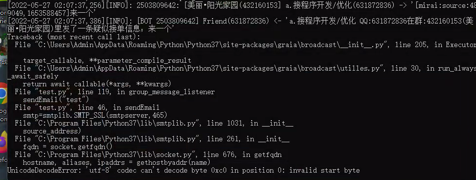

# QQ机器人

## 目前只支持windows10版本，以下是机器人在windows的配置。
## 功能目前有：监听关键词转发QQ群、监听关键词转发至QQ、转发至邮箱、转发至手机短信。后面的版本支持转发至微信及企业微信、手机弹窗震动
## 版本号：1.1

## 机器人window环境配置

使用注意事项：电脑的QQ版本和手机QQ版本不能再更新,不频繁更换机器人QQ的ip

先装java jdk 1.8.0.181
https://www.oracle.com/java/technologies/downloads/#jdk18-windows

然后安装python3.7.4
https://www.python.org/downloads/release/python-374/
python的安装事项：
需要选择自定义安装，安装到C盘，不要选择软件自己选择的默认安装路径，否则python脚本无法运行。

安装哪些：

先安装最新的版本，然后降级安装。
pip install graia-application-mirai
pip install graia-application-mirai==0.18.4

安装这两条命令的时候，遇到下面截图的问题，请按下面的解决方案处理：

<<<<<<< HEAD

=======

>>>>>>> a2492760ed491f6499ea0c92abf709bd4c541240

Could not install packages due to an EnvironmentError: [Errno 13] Permission denied: 'c:\\program files\\python37\\Lib\\site-packages\\typing_extensions.py'
Consider using the `--user` option or check the permissions.

遇到这样的报错：
解决方案：命令后面加--user
pip install graia-application-mirai --user
pip install graia-application-mirai==0.18.4 --user

配置文件里的账号密码都需要配置一下。

python发送邮箱的时候遇到编码问题：

UnicodeDecodeError: 'utf-8' codec can't decode byte 0xc0 in position 0: invalid start byte

解决办法：
https://blog.csdn.net/prince70/article/details/109625449

打开目录：C:\Program Files\Python37\lib\socket.py，修改676行代码：

hostname, aliases, ipaddrs = gethostbyaddr(name) 改为下面的代码：
hostname, aliases, ipaddrs = gethostbyaddr(name.encode('ascii','ignore'))

如果报错：

AttributeError: 'Element' object has no attribute 'asSerializationString'
解决办法：

下面的命令依次运行一遍。

pip install graia-application-mirai --user
pip install graia-application-mirai==0.18.4 --user

然后点击start.bat即可恢复正常。

切换QQ账号：

找到机器人文件夹下的
config\Console\AutoLogin.yml

然后再找到：
test.py文件里的机器人账号也必须要更改。
robotqq=

机器人账号都改完之后，关闭所有命令行窗口，进行下面的操作：

点击mcl.cmd后，出现下面的提示，才算登录成功。

修改关键词如何生效

找到robotqq目录下的test.py文件

修改完关键词后，关闭start.bat文件打开的监听窗口即可，mcl.cmd打开的窗口不要关闭。然后重新点击start.bat文件，就生效了。

如果出现提醒qq版本太旧的问题

一般是qq多次切换异地登录、账号密码错误、qq被冻结，请确定下qq是否正常，qq账号密码是否正确。然后等级太小的小号也会出现这样的情况
有的客户修改密码也能解决该问题。客户需逐一排查qq问题。该问题由腾讯限制导致，所以请多尝试几个qq。实在不行，直接联系我。

相关问题：
https://github.com/mamoe/mirai/issues/621
https://github.com/xggz/mqr/issues/2
https://github.com/yyuueexxiinngg/onebot-kotlin/issues/122
https://www.bbsmax.com/A/RnJW4qOB5q/

机器人采用的端口号是8080，如果被占用了，请使用如下方法：

找到test.py

8080改下

然后移步robot\config\net.mamoe.mirai-api-http\setting.yml

改完后所有软件窗口关掉。
重新打开两个软件。
